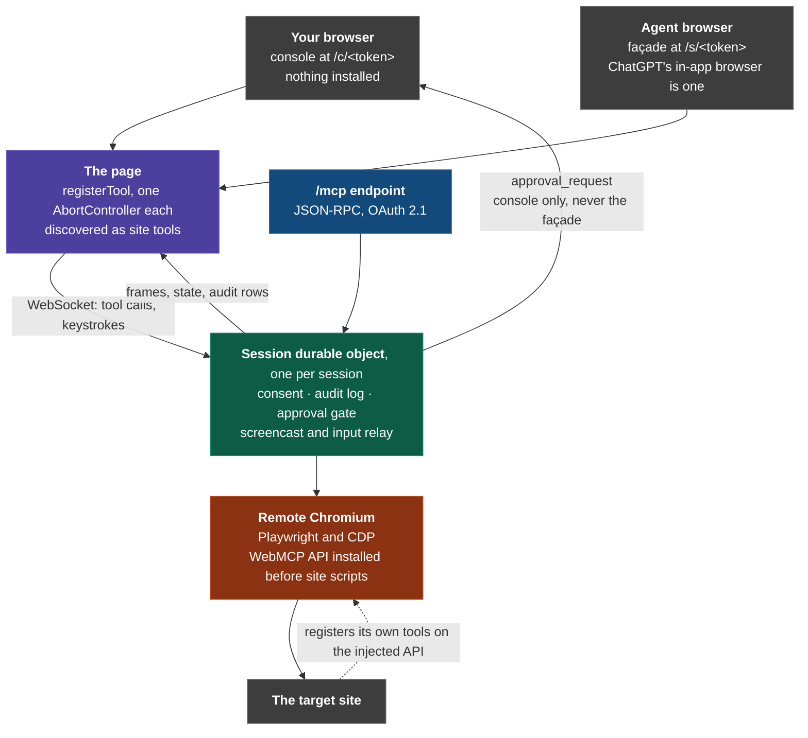

# BrowserMatic

**Every site's own tools. One conversation. Names only.**

Ask an assistant to compare four stores, book dinner and a film, price a trip,
or fill the twentieth council form, and it stalls at the same wall: a site's
agent tools only exist on that site's own page. Four stores means four
conversations.

BrowserMatic is one session that spans origins. Type a web address and we open
it in a browser that installs the WebMCP API **before the site's own code
runs**. The site registers its own tools, we add none, and we carry them into
your assistant, origin-qualified, across as many sites as you like.

**Live:** <https://browsermatic.dev>. No login, no key, no install.


## Try it in a minute

1. Open the live URL, type `allbirds.com`, press Go.
2. The store's own tools appear as chips: `search_catalog_on_allbirds_com`,
   `update_cart_on_allbirds_com` and the rest. Ten of them, every one
   registered by Allbirds' own script.
3. Every site in the catalog is callable too: automation is the default, so
   several stores sit in one tool list at once. Toggle **Autonomous** off in
   the console if you would rather grant each site yourself.
4. Ask for a checkout fill. It stops and names the exact profile fields before
   any of them leave your machine.

Any https origin works, not a fixed list. `inspect_site` reports what the page
actually exposes: its own WebMCP tools if it publishes any, otherwise the
forms, search actions and controls it does have. On Hacker News that is
`GET //hn.algolia.com/ (q)`; on GOV.UK, `GET /search/all (keywords)`. Turning
those into callable tools is the next phase
(`docs/design/2026-09-04-generated-tools-design.md`).

In ChatGPT desktop use **GPT-5.6 Sol or Terra**. Luna has WebMCP disabled, and
Enterprise/Edu workspaces have no site tools. Give it the `/s/<token>` URL.

## One session, two views

`/c/<token>` is the **console**, the view you open. It holds the profile and is
the only view that can approve a field leaving your machine.

`/s/<token>` is the **façade**, the view an agent loads. It registers the tools
and holds no profile.

Both connect at once, which is the normal way to use this, and it is the
point. People and agents work the same page together: the agent calls the
site's structured tools while you watch the live viewport, take the keyboard
whenever you want, and approve a profile field by name mid-flight without
stopping the conversation. Neither of you is driving blind, and neither is
waiting for the other to finish.

## What is true

"Your data never leaves your device" would be false here. Injected fields
travel page → Worker → Durable Object → the target origin, and a store
legitimately learns a shipping address when checkout is filled. What follows
is what actually holds.

- The profile is never uploaded wholesale. Only declared paths resolve.
- Values are never logged. The audit table has no value column.
- A tool that draws on the profile cannot run unattended. It waits ten seconds
  for a human to approve it by name, then hands back an id to redeem rather
  than holding the call open; with no console attached at all it returns
  `needs-console` rather than filling blanks and reporting success. An agent
  holding the same token cannot answer for you: the façade is never sent the
  request.
- Keystrokes in the viewport cross this Worker in plaintext and are not stored.

## Why WebMCP

An agent can already drive a website by guessing: read the DOM, find something
that looks like a search box, click it. That works until the site changes, and
it fails silently when it fails.

WebMCP inverts it. The site *declares* what an agent may do, names the
arguments, and runs its own handler. So `update_cart` is Shopify's code with
Shopify's validation, not our reconstruction of it. When a store redesigns its
checkout, a scraper breaks and a declared tool keeps working. The contract is
the tool, not the markup.

That is also why the consent model fits rather than fights: the site opted in
by publishing, and the human opts in per origin and per profile field. Nobody
is being worked around.

The gap was never the standard. It was reach. Tools are scoped to the page
that registered them, and the browser API is behind an origin trial, so a site
that fully implemented WebMCP exposes nothing in almost any browser. This
closes both.

## Architecture

Two browsers, and the difference matters. **Yours** just loads a web page,
with no extension, no flag and no download. ChatGPT's in-app browser is one of
them. **Ours** is a second, remote Chromium that opens the target site, and it
is the one the WebMCP API is installed into.



So the site's tools run in our browser, and appear in yours.

Load-bearing decisions:

- **Imperative `registerTool` on the top-level page.** ChatGPT's browser has no
  declarative form and does not discover tools in iframes.
- **A capability URL, not a login.** ChatGPT will not carry a session cookie.
  High-entropy token in the path, short TTL, revocable, `Referrer-Policy:
  no-referrer`.
- **Origin-qualified names, always.** `search_flights_on_kayak_com`, never
  `search_flights`. ChatGPT's permission model is per-site, so spanning origins
  extends it rather than routing around it.
- **One `AbortController` per tool.** WebMCP has no `unregisterTool` and a
  duplicate name throws, so granting a fourth store never disturbs the first
  three.
- **Automation is the default; the grant click is the option.** Autonomous mode
  is on unless you turn it off. Granting an *origin* is automatic; releasing a
  *profile field* is not.
- **An audit table with no value column.** "We don't log it" is a policy;
  "there is nowhere to log it" is an architecture.
- **Fail-closed SSRF on every navigation**, whoever initiated it. Hostname
  literals and resolved A/AAAA records both checked; a resolver error rejects.
- **No LLM in the hot path.** Tools replay a bound sequence or call the remote
  page's own handler. Execution is deterministic.

## Two surfaces

The façade at `/s/<token>` is what ChatGPT's in-app browser sees. The same
Worker also speaks MCP at `/mcp` over JSON-RPC, with a bearer token or OAuth
2.1 and PKCE. It is verified against the official MCP SDK, so any compliant
client drives
the identical session headlessly. See [docs/oauth.md](docs/oauth.md).

## Setup

```bash
pnpm install
pnpm test
pnpm dev
pnpm run deploy   # `pnpm deploy` is pnpm's own workspace command, not this script
```

Browser Rendering must be enabled on the account. One browser per session,
started on the first grant and released when you leave.

No API key is required. The optional in-page chat panel reaches a model through
the Cloudflare `ai` binding; drop that binding and set `OPENAI_API_KEY` to call
directly. Either way the key never reaches the page. ChatGPT drives the
registered tools with no model configured at all.

Façade headers (`public/_headers`): `Origin-Agent-Cluster: ?1`,
`Permissions-Policy: tools=*`, `Referrer-Policy: no-referrer`.

## Limits

- A passkey signs you in to BrowserMatic itself, on your own device. It cannot
  log you in to a *remote site*: that authenticator is on your machine and the
  remote browser runs in Cloudflare's network. Demo remote logins with a
  password or OAuth.
- Selectors in hand-written manifests are bound at authoring time and break
  when a site redesigns.
- Verified against Allbirds and Brooklinen. The `/mcp` surface is proven
  against the MCP SDK; individual MCP clients are listed in
  `tests/MCP_CLIENTS.md`.

Design decisions are recorded in the commit history and in `docs/`.
